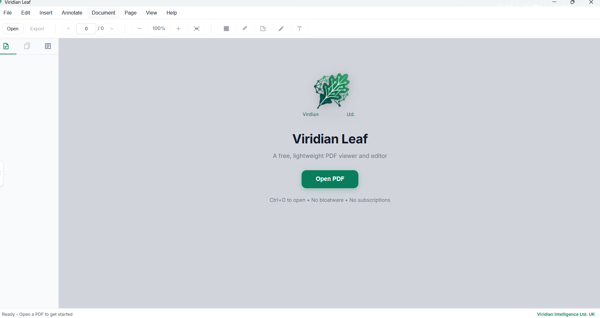

# Viridian Leaf

A free, open-source PDF viewer and editor for Windows and macOS.

**No bloatware. No subscriptions. No ads. Just PDFs.**



Built with [Tauri](https://tauri.app) + [React](https://react.dev) + [PDF.js](https://mozilla.github.io/pdf.js/)

Developed by **Viridian Intelligence Ltd. UK**

## Features

### Core PDF Features
- **PDF Viewer** - Fast rendering with smooth zoom and scroll
- **Page Navigation** - Thumbnail sidebar, keyboard shortcuts, page jump
- **Zoom Controls** - Fit to width, fit to page, custom zoom levels (Ctrl+scroll)
- **Multi-Tab Support** - Open multiple PDFs in tabs
- **View Modes** - Single page, two-page, or continuous scroll

### Annotations & Editing
- **Highlights** - Select text and highlight in multiple colors
- **Text Boxes** - Add text annotations anywhere on the page
- **Sticky Notes** - Add collapsible notes to pages
- **Freehand Drawing** - Draw with customizable colors and widths
- **Signatures** - Draw and save signatures for reuse
- **Images** - Insert images onto PDF pages
- **Links** - Add clickable link areas
- **Redaction** - Black out sensitive information permanently

### AI Assistant (NEW)
- **Document Q&A** - Ask questions about your PDF content
- **AI Summarization** - Get quick summaries of documents
- **OpenAI Compatible** - Works with OpenAI, Azure OpenAI, or any compatible API
- **Local AI Support** - Use Ollama for free, private AI (no cloud required)
- **Non-blocking UI** - Continue viewing PDFs while AI processes

### Export & Conversion (NEW)
- **Export to Word (.docx)** - Convert PDFs to editable Word documents
- **Export to PowerPoint (.pptx)** - Create presentations from PDF content
- **Extract Tables to Excel (.xlsx)** - Pull tabular data into spreadsheets
- **Export to Images** - PNG, JPEG export of any page or all pages
- **Export to Text/RTF/HTML** - Extract text in multiple formats

### Document Tools
- **PDF Merging** - Combine multiple PDFs into one with drag-and-drop ordering
- **Page Rotation** - Rotate individual pages or entire documents
- **Page Reordering** - Rearrange pages within a PDF
- **Page Deletion** - Remove unwanted pages
- **Watermarks** - Add text watermarks with custom positioning
- **Headers/Footers** - Add page numbers and custom text
- **OCR** - Extract text from scanned PDFs using Tesseract.js
- **Read Aloud** - Text-to-speech for document content

### User Experience
- **Dark Theme** - Modern, easy on the eyes interface
- **Bookmarks** - Built-in PDF bookmarks + custom bookmarks
- **File Association** - Double-click PDFs to open directly
- **Remember Position** - Reopens PDFs where you left off
- **Recent Files** - Quick access to recently opened documents
- **Undo/Redo** - Full history for annotation changes
- **Lightweight** - ~15MB installer (vs 150MB+ for Electron apps)
- **Native Performance** - Rust backend, minimal resource usage

## Installation (Windows)

### Easy Install (Recommended)

1. Go to the [Releases](https://github.com/Perspiqua/Viridian-Leaf/releases) page
2. Download **`Viridian Leaf_x.x.x_x64-setup.exe`** (the NSIS installer)
3. Run the downloaded file
4. If Windows SmartScreen appears, click **"More info"** then **"Run anyway"** (the app is unsigned but safe)
5. Follow the installer prompts
6. Done! Launch from Start Menu or double-click any PDF

### To Uninstall

Go to **Windows Settings** > **Apps** > **Installed apps** > Find "Viridian Leaf" > **Uninstall**

### Set as Default PDF Viewer

1. Right-click any PDF file
2. Select **"Open with"** > **"Choose another app"**
3. Select **"Viridian Leaf"**
4. Check **"Always use this app to open .pdf files"**
5. Click **OK**

Now all PDFs will open in Viridian Leaf when double-clicked!

---

## Build from Source (Advanced)

Only needed if you want to modify the code or build for other platforms.

**Prerequisites:**
- [Node.js](https://nodejs.org/) 18+
- [Rust](https://www.rust-lang.org/tools/install)
- [Visual Studio Build Tools](https://visualstudio.microsoft.com/visual-cpp-build-tools/) (Windows)

```bash
# Clone the repository
git clone https://github.com/Perspiqua/Viridian-Leaf.git
cd Viridian-Leaf

# Install dependencies
npm install

# Run in development mode
npm run tauri dev

# Build installer for production
npm run tauri build
```

The installers will be created in `src-tauri/target/release/bundle/`:
- `nsis/` - Windows Setup EXE (recommended)
- `msi/` - Windows Installer MSI

## Keyboard Shortcuts

| Shortcut | Action |
|----------|--------|
| Ctrl+O | Open PDF |
| Ctrl+S | Save PDF |
| Ctrl+E | Export to Image |
| Ctrl+F | Find text |
| Ctrl+Z | Undo |
| Ctrl+Y | Redo |
| Ctrl++ | Zoom In |
| Ctrl+- | Zoom Out |
| Ctrl+0 | Actual Size (100%) |
| Left/Right | Previous/Next Page |
| Home/End | First/Last Page |
| F9 | Toggle Sidebar |
| F11 | Full Screen |
| Ctrl+Scroll | Zoom |

## Setting Up AI (Optional)

### Option 1: OpenAI API
1. Go to **Document** > **AI Settings**
2. Enter your OpenAI API key
3. Set model to `gpt-4o-mini` or `gpt-4o`
4. Click Save

### Option 2: Ollama (Free, Local AI)
1. Download [Ollama](https://ollama.ai) for your platform
2. Run `ollama pull llama3.2` in terminal
3. In Viridian Leaf, go to **Document** > **AI Settings**
4. Enable "Use local AI (Ollama)"
5. Click Save

The AI panel appears on the right side when viewing a PDF.

## Tech Stack

- **Frontend:** React 19 + TypeScript + Vite
- **Backend:** Rust + Tauri 2.0
- **PDF Rendering:** PDF.js (Mozilla)
- **PDF Editing:** pdf-lib
- **AI:** OpenAI API / Ollama (local)
- **Office Export:** docx, pptxgenjs, xlsx
- **OCR:** Tesseract.js
- **Styling:** CSS with dark/light themes

## License

MIT License - see [LICENSE](LICENSE)

Copyright (c) 2026 Viridian Intelligence Ltd. UK

## Contributing

Contributions are welcome! Please feel free to submit a Pull Request.

## Support

For issues and feature requests, please use the [GitHub Issues](https://github.com/Perspiqua/Viridian-Leaf/issues) page.

---

Made with care by [Viridian Intelligence Ltd. UK](https://viridian-intelligence.co.uk)

**Also check out [Perspiqua.com](https://perspiqua.com)** - R&D Tax Credit specialists helping UK businesses claim back money for innovation.
